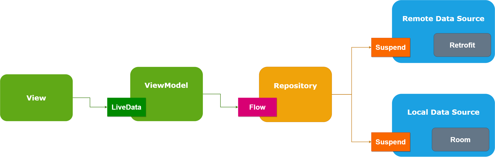

# DemoTMDB

DemoTMDB is the sample app to demonstrate the Android MVVM Architecture with Retrofit, Coroutines, Hilt, Kotlin Flow and Room Database.

[The in-depth details about this sample app can be found at this Medium article.](https://narendrasinhdodiya.medium.com/android-architecture-mvvm-with-coroutines-retrofit-hilt-kotlin-flow-room-48e67ca3b2c8)

## Architecture

## Screenshots
| |  |
